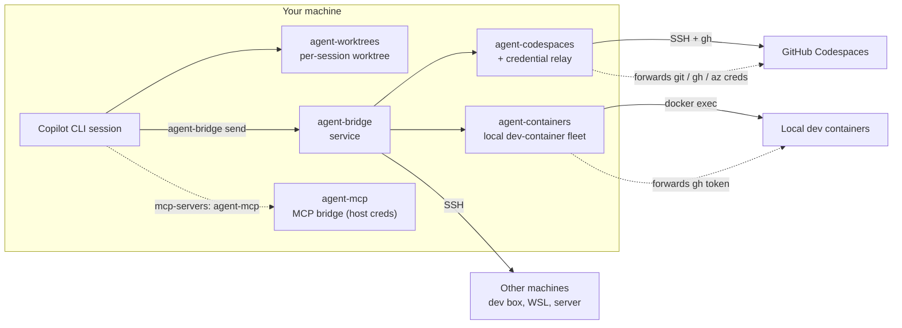
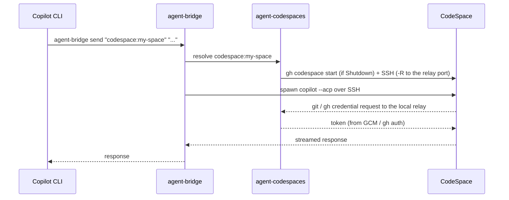

# copilot-extensions

> **⚠️ `main`'s git history was rewritten.** This repository's `main` branch
> had its git **history** (not content) rewritten to purge ~150-300MB of
> accumulated binary bloat (`.github/coverage-baselines/*`, committed before
> the coverage-baseline design moved to GitHub Release assets — see
> [PR #5078](https://github.com/ThomasMichon/copilot-extensions/pull/5078)).
> Pre-rewrite tip: `b8e83826124674f16ecb200d4c2709c77b87dc0b`.
> Post-rewrite tip: `3a9b9f90b7e02de4da49376323294b3474d483f6` (2026-10-04). If your
> local clone tracks `main` directly, see
> [`docs/pipelines.md`'s "If `main`'s history is force-rewritten"
> section](docs/pipelines.md#if-mains-history-is-force-rewritten) for recovery. **`dev` was never affected.** Full
> procedure and status: [`efforts/done/main-history-rewrite`](efforts/done/main-history-rewrite/README.md).

<p align="center">
  
</p>

<p align="center"><em>The <strong>Worktree Picker</strong> — the front door to your fleet of
worktree-backed agents, at a glance across every machine.</em></p>

A [Copilot CLI](https://docs.github.com/copilot/how-tos/use-copilot-agents/use-copilot-cli)
plugin suite that gives every session its **own isolated git worktree** and lets
your agents **talk to each other** — across worktrees, across machines, and into
**GitHub Codespaces** and **local dev containers** — with credentials forwarded
securely along the way. The **agent-mcp** plugin wraps authenticated **MCP
servers** so those same host credentials reach your tools.

Plugins, one marketplace. Install what you need; they compose.

## Quick start — one-line setup

Bootstrap a machine into a working harness with the standalone **Configurator**
— an out-of-plugin app that installs the prerequisites and the core, then adopts
your first repo (it must run *before* the plugins do, so it is delivered
**outside** the plugin pipe).

> **Status — not yet available.** The Configurator is being built under
> [#352](https://github.com/ThomasMichon/copilot-extensions/issues/352) (a Phase 0
> skeleton today; prerequisite + core install land next). **Until it ships**, set
> up **today** by installing the plugins from the marketplace — start with
> **agent-worktrees** (see the table below and its
> [Getting Started](plugins/agent-worktrees/docs/getting-started.md)), then add the
> others as you need them.

When it ships, one line will bootstrap a machine:

**Windows (PowerShell):**

```powershell
iex (irm https://raw.githubusercontent.com/ThomasMichon/copilot-extensions/main/configurator/bootstrap.ps1)
```

**macOS / Linux:**

```bash
curl -fsSL https://raw.githubusercontent.com/ThomasMichon/copilot-extensions/main/configurator/bootstrap.sh | bash
```

| Plugin | Type | What it gives you |
|--------|------|-------------------|
| [agent-worktrees](plugins/agent-worktrees/) | Session tool | Each Copilot CLI session runs in its own git worktree — no branch conflicts, no stale state. Install this first. |
| [agent-pull-requests](plugins/agent-pull-requests/) | Cross-repo PR CLI | Query and eventually drive pull requests by explicit `owner/repo`, even when no local checkout exists. This first runtime-backed slice ships a standalone `status` verb, deploys a real `~/.local/bin/agent-pull-requests` binstub, and stages the broader extraction from `agent-worktrees`. |
| [agent-bridge](plugins/agent-bridge/) | Persistent service | Converse with and steer live agents across worktree, repository, machine, CodeSpace, and container boundaries. |
| [agent-codespaces](plugins/agent-codespaces/) | CLI + relay | Create/manage GitHub Codespaces, address them as bridge agents (`codespace:<name>`), and forward git/GitHub/Azure credentials into them. |
| [agent-containers](plugins/agent-containers/) | CLI + resolver | Manage a fleet of local Docker dev containers, borrow/release them per effort, and address them as bridge agents (`container:<name>`). |
| [agent-mcp](plugins/agent-mcp/) | MCP bridge | Wrap an upstream MCP server (HTTP or stdio), inject host credentials, reshape its catalog, and materialize a bridge-equivalent fallback. Agent authoring policy remains in `customizing-copilot`. |
| [agent-ssh](plugins/agent-ssh/) | SSH connectivity CLI | Emit and verify machine-name SSH profiles from a normalized registry, and define the public transport-provider contract for direct or tunnel transports. |
| [agent-remote-driver](plugins/agent-remote-driver/) | SDK extension | User-global, launch-time SDK extension giving any `copilot` session baseline drivability (attach to its live event stream, send/steer, abort) over a loopback HTTP surface, independent of agent-bridge or any other coordination plugin being installed in that venue. Payload-only — no runtime to install. Not yet enabled by default (`cli-default-bridging` effort, pre-validation). |
| [efforts](plugins/efforts/) | Planning skills | Plan a stretch of work as an **effort** — a folder with a README-as-shared-contract (premise + plan + journal) that humans and agents coordinate through. The executor plugins above bind its participant seam. |
| [visions](plugins/visions/) | Planning skills | Keep a persistent **vision** — a north-star statement of what a system should ultimately be — and derive efforts from the delta between vision and reality. Payload-only — no runtime to install. |
| [agent-logger](plugins/agent-logger/) | Session logging | Turn raw Copilot sessions into structured Markdown logs — a segmenter, a voice-neutral log-writer agent, and a `session-sync` step that pushes local or validated provider-rescued session data to a configurable target (local / OneDrive / SSH / ingest). Personality is injected by the host, never built in. |
| [context-handoff](plugins/context-handoff/) | Ambient policy + extension + skill | Keep a continuity contract active through a concise session-start kernel, watch the context window via a session extension, and transfer unfinished objectives into successor sessions before compaction. Payload-only — no runtime to install. |
| [agent-dispatch](plugins/agent-dispatch/) | Task queue + coordinator | Manage durable queued task loops with deduplication, atomic claims, routing, retries, supervision, terminal task state, and declarative repository review or issue loops. |
| [agent-index](plugins/agent-index/) | Index/search service | Portable indexing and semantic-search engine for a harness repo and its immediate ecosystem. Phase 1 ships the service shell; indexing and retrieval arrive in later slices. |
| [agent-machines](plugins/agent-machines/) | Machine-state reconciler | Portable restore-machinestate — converge a machine to desired state declared in in-repo requirement packages (Copilot settings first). Machine-scoped union restore, a seven-disposition model, and a detect-not-arbitrate conflict validator. Its self-update sweep now runs only the maintenance-safe restore subset (manage reconciliation, opted-in resources, pinned installed-package realignment, and runtime spot checks). |
| [agent-vault](plugins/agent-vault/) | CLI + service | Local KeePassXC-backed secret store — a machine-local service caches the master password with a TTL and auto-prompts on lock; a CLI fetches API keys, SSH keys, and credentials on demand without hardcoding, committing, or env-exporting them. Ships a SUDO_ASKPASS helper for `sudo -A`. |
| [customizing-copilot](plugins/customizing-copilot/) | Customizing and diagnosing the CLI | Teach an agent how to customize, diagnose, and extend the Copilot CLI — authoring skills, defining sub-agents, registering MCP servers, installing plugins, building a control-harness, reviewing customizations, diagnosing startup hangs, authoring `<repo>-harness` plugins, and setting up an instruction-projection sync worker. Eleven focused skills. Payload-only — no runtime to install. |
| [copilot-extensions-harness](plugins/copilot-extensions-harness/) | Operator harness | Portable owner-authored skills, the `clean-room-judge` evaluator agent, and an ambient pointer to the general-purpose, organization-neutral contribution boundary. Enable it in any control repo instead of hand-writing a per-repo narrative. Reference implementation of the `<repo>-harness` standard. Payload-only. |
| [wsl-setup](plugins/wsl-setup/) | Environment setup | Set up and troubleshoot WSL2 as a reachable, persistent service host — pick the networking mode (NAT + localhostForwarding vs mirrored), diagnose corp-network egress + host↔WSL loopback failures, and keep a distro alive for a hosted listener (e.g. sshd behind a Dev Tunnel). Ships a windowless keepalive helper. |
| [harness-knowledge](plugins/harness-knowledge/) | Binding skill | Bind a stateless control harness to its private **knowledge** repo, harness-first — ask for (or create) the knowledge repo, write the machine-local `knowledge_repo` pointer, and assemble a machine-local instructions fragment labeling the concrete harness/knowledge/product paths. Keeps the shareable harness tree generic + name-free. Payload-only. |
| [ai-attribution](plugins/ai-attribution/) | Ambient policy + skills | Keep publication and AI-attribution safety active through a concise payload-cwd-gated session-start kernel, host-qualified operator policy, an idempotent static-fallback setup skill, and an on-demand publication workflow. Payload-only; no runtime, network call, or authentication. |
| [delegation-guidance](plugins/delegation-guidance/) | **Deprecated** — no-op pointer | Migrated into `agent-conduct-guidance`'s delegation module. Kept installable so the name keeps resolving for existing adopters; ships no skills or projections of its own. |
| [budget-guidance](plugins/budget-guidance/) | Budget posture CLI | Resolve strict offline allowance, consumption, reset, freshness, rate, and ceiling readings into one attributable posture with JSON and concise human status. |
| [agent-conduct-guidance](plugins/agent-conduct-guidance/) | Ambient policy + skills | Consolidated, generally-good agent conduct guidance: one plugin hosting multiple independent ambient modules (instruction projection + paired skill each). Modules: process-spawn hygiene (spawn every ad hoc CMD/PowerShell/Python/Node/etc. child process headlessly, especially on Windows), coordinator-first delegation (route broad separable work into bounded sub-agent contexts while the coordinator retains synthesis and completion), and scratch-space hygiene (resolve a portable scratch root and a timestamped per-task subfolder before writing an ad hoc working file outside a repository). Payload-only; no runtime. |

All support **Windows** and **Linux/WSL** (macOS planned).

---

## Architecture at a glance

24 plugins, one marketplace. **Thirteen ship a runtime** (a `uv`-built venv under
a plugin-owned runtime root such as `~/.agent-*` or `~/.budget-guidance`, plus a
`~/.local/bin` binstub, deployed by the plugin's own installer); **eleven are
payload-only** — `efforts` (skills), `visions` (skills),
`context-handoff` (hook + session extension + skill), `customizing-copilot` (skills),
`copilot-extensions-harness` (skills + contribution-boundary hook), `wsl-setup` (skills),
`harness-knowledge` (skills), `ai-attribution` (hook + skill),
`delegation-guidance` (hook + skill), `agent-conduct-guidance`
(instruction projection + skill), and `agent-remote-driver` (SDK extension)
need no install beyond enabling the plugin.
Everything installs **from the marketplace** and runs
**from local install paths** — no git checkout required at runtime.

```mermaid
flowchart TB
    MP["GitHub marketplace<br/>ThomasMichon/copilot-extensions"]
    subgraph IP["~/.copilot/installed-plugins/copilot-extensions/"]
      AW["agent-worktrees<br/>skills + sessionStart hook"]
      AB["agent-bridge<br/>service source + libs/ssh-manager"]
      AC["agent-codespaces<br/>CLI + credential relay"]
      AN["agent-containers<br/>CLI + container: resolver"]
      AM["agent-mcp<br/>MCP bridge CLI"]
      AS["agent-ssh<br/>SSH profile CLI"]
      AL["agent-logger<br/>session-sync + log writer"]
      AD["agent-dispatch<br/>task-queue service + CLI"]
      AI["agent-index<br/>index/search service"]
      AK["agent-machines<br/>machine-state reconciler CLI"]
      AV["agent-vault<br/>secret store CLI + service"]
      PO["efforts · visions · context-handoff · customizing-copilot<br/>copilot-extensions-harness · wsl-setup · harness-knowledge · ai-attribution · delegation-guidance (deprecated) · agent-conduct-guidance<br/>(payload-only: skills / hooks / extension)"]
    end
    subgraph RT["Local runtimes — ~/.* + ~/.local/bin"]
      RW["~/.agent-worktrees<br/>agent-worktrees"]
      RPR["~/.agent-pull-requests<br/>agent-pull-requests"]
      RB["~/.agent-bridge<br/>service (OS-assigned port)"]
      RC["~/.agent-codespaces<br/>agent-codespaces"]
      RN["~/.agent-containers<br/>agent-containers"]
      RM["~/.agent-mcp<br/>agent-mcp"]
      RS["~/.agent-ssh<br/>agent-ssh"]
      RL["~/.agent-logger<br/>session-sync task + digests"]
      RD["~/.agent-dispatch<br/>queue db + coordinator"]
      RI["~/.agent-index<br/>service + engine"]
      RK["~/.agent-machines<br/>reconciler"]
      RV["~/.agent-vault<br/>secret store service"]
    end
    MP -->|copilot plugin install| AW
    MP -->|copilot plugin install| APR["agent-pull-requests<br/>cross-repo PR CLI"]
    MP -->|copilot plugin install| AB
    MP -->|copilot plugin install| AC
    MP -->|copilot plugin install| AN
    MP -->|copilot plugin install| AM
    MP -->|copilot plugin install| AS
    MP -->|copilot plugin install| AL
    MP -->|copilot plugin install| AD
    MP -->|copilot plugin install| AI
    MP -->|copilot plugin install| AK
    MP -->|copilot plugin install| AV
    MP -->|copilot plugin install| PO
    AW -->|init.ps1 / init.sh| RW
    APR -->|install.ps1 / install.sh| RPR
    AB -->|install.ps1 / install.sh| RB
    AC -->|init.ps1 / init.sh| RC
    AN -->|init.ps1 / init.sh| RN
    AM -->|init.ps1 / init.sh| RM
    AS -->|install.ps1 / install.sh| RS
    AL -->|install.ps1 / install.sh| RL
    AD -->|install.ps1 / install.sh| RD
    AI -->|install.ps1 / install.sh| RI
    AK -->|install.ps1 / install.sh| RK
    AV -->|install.ps1 / install.sh| RV
    AC -.->|codespace: provider via providers.d/ manifest| RB
    AN -.->|container: provider via providers.d/ manifest| RB
```



Each runtime plugin is itself a **Python package** (its `src/` plus vendored
`libs/`); the installer creates the venv with `uv venv` and installs the package
with `uv pip install <plugin_dir>`. See
[Quick Start](#quick-start) and [Architecture overview](docs/architecture.md)
for the payload-vs-runtime split.


How the pieces relate at run time:



---

## Quick Start

> Goal: from a fresh machine to *"send a prompt to my CodeSpace and get work
> done"* in a handful of steps. New to this? Read
> [Concepts](#concepts-the-control-harness-repo) first.

### Prerequisites

- **Copilot CLI** (`copilot` on PATH) · **Python 3.10+** · **Git 2.15+**
- **gh CLI**, authenticated (`gh auth login`) — for agent-codespaces and agent-containers
- **Docker** (Docker Desktop WSL2 backend) — for agent-containers only
- **uv** (bootstrapped automatically by the init scripts if missing)

### 1. Install the plugins

Install agent-worktrees first; add the others as you need them. agent-codespaces
and agent-containers **self-register** their `codespace:` / `container:`
namespaces with agent-bridge by dropping a `~/.agent-bridge/providers.d/`
manifest on session start — there is **no install-order requirement** and no
package import, so a provider installed at any time is discovered on demand.

```bash
copilot plugin marketplace add ThomasMichon/copilot-extensions
copilot plugin install agent-worktrees@copilot-extensions
copilot plugin install agent-codespaces@copilot-extensions
copilot plugin install agent-containers@copilot-extensions
copilot plugin install agent-bridge@copilot-extensions
copilot plugin install agent-mcp@copilot-extensions      # optional, standalone
copilot plugin install agent-logger@copilot-extensions   # optional — session logging
copilot plugin install agent-index@copilot-extensions    # optional — indexing/search service shell
copilot plugin install efforts@copilot-extensions        # optional — planning skills (no runtime)
copilot plugin install context-handoff@copilot-extensions # optional — context-window handoff (no runtime)
copilot plugin install customizing-copilot@copilot-extensions # optional — how to customize the CLI (no runtime)
copilot plugin install ai-attribution@copilot-extensions # optional — ambient publication safety (no runtime)
copilot plugin install agent-conduct-guidance@copilot-extensions # optional — consolidated agent conduct guidance (no runtime)
```

Each `copilot plugin install` only vendors the plugin's **payload** (source,
skills, hooks, extensions). The thirteen runtime plugins (every plugin except the
payload-only `efforts`, `visions`, `context-handoff`, `customizing-copilot`,
`copilot-extensions-harness`, `wsl-setup`, `harness-knowledge`, and
`ai-attribution`, `delegation-guidance`, and `agent-conduct-guidance`) then need their runtime deployed once — that's Step 2,
which runs each installer to build a `uv` venv under its plugin-owned home and drop a
binstub in `~/.local/bin`.

> **Recommended: register at repo scope instead of globally.** Set
> `"experimental": true` in `~/.copilot/settings.json`, then declare the
> marketplace + `enabledPlugins` in your control repo's committed
> `.github/copilot/settings.json`. Copilot vendors the payloads when a session
> runs in that repo (agent-worktrees may need a session restart to take effect),
> Step 2 deploys the runtimes, and every subsequent launch via the
> binstub/terminal profile runs `agent-worktrees reconcile-plugins` to keep the
> payloads and runtimes fresh automatically. See
> [`agent-worktrees:copilot-extensions-setup`](plugins/agent-worktrees/skills/copilot-extensions-setup/SKILL.md)
> § 0 and [install-contract.md](docs/install-contract.md).

### 2. Bootstrap the runtimes

Start a Copilot CLI session and say **"set up copilot extensions"** — the
[`agent-worktrees:copilot-extensions-setup`](plugins/agent-worktrees/skills/copilot-extensions-setup/SKILL.md)
skill runs each installer so the runtimes land under `~/.agent-*` with binstubs
in `~/.local/bin`. (Prefer to do it by hand? See each plugin's Getting Started,
linked below.)

Verify:

```bash
agent-worktrees --version
agent-bridge version && agent-bridge status
agent-codespaces version
agent-ssh version
```

### 3. Adopt your control-harness repo

Adopt your control repo (see [Concepts](#concepts-the-control-harness-repo)) so
worktrees, topology, and Codespaces all read from one place:

```bash
cd /path/to/my-control-harness
agent-worktrees register my-control-harness          # worktree sessions + binstub
agent-bridge config adopt --repo . --profile my-control-harness
agent-codespaces config adopt
```

### 4. First send — local, then CodeSpace

```bash
# Talk to a local agent (no SSH needed)
agent-bridge send local "Print the working directory and git branch."

# Talk to a CodeSpace through the bridge (auto-starts it; creds forwarded)
agent-codespaces bridge register
agent-bridge send "codespace:<name>" "Run: pwd && git rev-parse --abbrev-ref HEAD && gh auth status"
```

---

## Concepts: the control-harness repo

A **control-harness repo** is your own repo (a dotfiles-style "hub") that drives
the whole system. In examples it's called `my-control-harness`. It:

- is **adopted by agent-worktrees** (gets a project binstub + worktree root),
- holds the **topology** the bridge reads — `machines.yaml` (machines + SSH) and
  `acp-agents.json` (agents), plus a supplementary `.agent-codespaces/config.yaml`
  (Codespace overrides + credential-relay policy; most repos need none) and
  `containers.yaml` (local dev-container fleet
  defaults), and
- doubles as the **Codespaces dotfiles repo**, so the same repo provisions each
  CodeSpace.

One repo, one source of truth, the mesh plugins reading from it. (agent-mcp is
standalone — its bridge configs are per-agent files, preferably in-repo via
`--config` for repo-scoped agents, or under `~/.agent-mcp/bridges/` for personal
ones; not the control repo.)

> **Building or auditing a harness?** Point an agent at the
> [Control-Harness Runbook](docs/harness-runbook.md) — an opinionated,
> phase-by-phase procedure for turning a repo into an effective agent harness
> with these plugins. It works from a fresh folder ("make me a control repo like
> this"), on an existing repo ("build out my harness"), or as an audit ("make
> sure my repo follows best practices").

---

## Usage flow: a CodeSpace session end-to-end



The credential relay (port **9857**) means the CodeSpace authenticates to GitHub
and Azure DevOps using **your host's** credentials — no PATs baked into the
CodeSpace.

---

## Updating

```bash
# Pull the latest plugin from the marketplace…
copilot plugin update agent-worktrees@copilot-extensions

# …or update the plugin + runtime in one step
agent-worktrees update
```

agent-worktrees also auto-updates its runtime on session launch. agent-bridge
and agent-codespaces update via their installers (`scripts/install.* update`).
agent-containers and agent-mcp re-run their `scripts/init.*` (with `-Force` /
`--force`) to redeploy the runtime.

## Uninstalling / baseline reset

The installer-based plugins (agent-worktrees, agent-bridge, agent-codespaces)
provide an `uninstall` action that stops their **own managed processes** before
removing files — agent-bridge stops the daemon + credential relay, and
agent-codespaces closes its SSH ControlMaster connections — so no manual
process-killing is needed:

```bash
scripts/install.sh uninstall          # per-plugin (add --purge / --remove-config to wipe config)
```

agent-containers and agent-mcp are init-only (no installer): remove them by
deleting `~/.agent-containers` / `~/.agent-mcp` and their `~/.local/bin`
binstubs.

To return a machine to a clean baseline in one step (stops everything, removes
the installer-based runtimes, binstubs, the service/scheduled task, and config)
use the repo-level reset tool — it's idempotent and works even if the CLIs are
broken:

```powershell
# Windows
pwsh -File tools\reset.ps1                       # prompts; add -Yes to skip
pwsh -File tools\reset.ps1 -Yes -RemovePlugins   # also `copilot plugin uninstall`
```
```bash
# Linux/WSL
bash tools/reset.sh                              # prompts; add --yes to skip
bash tools/reset.sh --yes --remove-plugins
```

> The reset tool currently targets the installer-based runtimes
> (`~/.agent-worktrees`, `~/.agent-bridge`, `~/.agent-codespaces`); remove
> `~/.agent-containers` and `~/.agent-mcp` manually until it covers them.

Your source repos and their `.worktrees` content are never touched.

---

## Documentation

### Guides & component breakdowns

| Document | What's inside |
|----------|---------------|
| [Control-Harness Runbook](docs/harness-runbook.md) | Opinionated, phase-by-phase procedure for building/extending/auditing an agent harness with these plugins |
| [Plugin consolidation](docs/plans/plugin-consolidation.md) | Discussion: whether to collapse the multi-plugin suite into fewer plugins, with decision criteria |
| [Architecture overview](docs/architecture.md) | How the plugins fit together: install topology, runtimes, ports, credential relay |
| [CI/CD Pipelines](docs/pipelines.md) | PR gating layers, the full `.github/workflows/` reference, and the `dev` → `main` promotion pipeline |
| [Rollout plan](docs/plans/rollout-readiness.md) | Onboarding-readiness plan and fixes |
| [Fresh dev box validation](docs/plans/fresh-devbox-validation.md) | Step-by-step validation on a clean machine |

### Agent Worktrees

| Document | Description |
|----------|-------------|
| [README](plugins/agent-worktrees/README.md) | Plugin overview |
| [Getting Started](plugins/agent-worktrees/docs/getting-started.md) | Install, adopt a repo, launch sessions |
| [Architecture](plugins/agent-worktrees/docs/architecture.md) | Plugin/runtime layers, session lifecycle |
| [CLI Reference](plugins/agent-worktrees/docs/cli-reference.md) | Commands, installer actions, config format |

### Agent Bridge

| Document | Description |
|----------|-------------|
| [README](plugins/agent-bridge/README.md) | Live cross-boundary agent communication and session transport |
| [Getting Started](plugins/agent-bridge/docs/getting-started.md) | Install, configure, start the service |
| [Architecture](plugins/agent-bridge/docs/architecture.md) | Service design, API reference, deployment |
| [Machine Configuration](plugins/agent-bridge/docs/machine-config.md) | Topology — `machines.yaml`, `acp-agents.json` |

### Agent Codespaces

| Document | Description |
|----------|-------------|
| [README](plugins/agent-codespaces/README.md) | Plugin overview, CLI reference, config format |
| [codespaces-setup](plugins/agent-codespaces/skills/codespaces-setup/SKILL.md) | First-time setup, adoption, credential relay config |
| [codespaces-lifecycle](plugins/agent-codespaces/skills/codespaces-lifecycle/SKILL.md) | Day-to-day ops — SSH, listing, bridge integration |

### Agent Containers

| Document | Description |
|----------|-------------|
| [README](plugins/agent-containers/README.md) | Plugin overview, CLI reference, config format, discovery |
| [containers-fleet](plugins/agent-containers/skills/containers-fleet/SKILL.md) | Fleet provisioning, borrow/release leases, `container:` dispatch |

### Agent MCP

| Document | Description |
|----------|-------------|
| [README](plugins/agent-mcp/README.md) | MCP transport boundary, bridge config, auth kinds, materialization, CLI |
| [agent-mcp](plugins/agent-mcp/skills/agent-mcp/SKILL.md) | Defining a bridge and wiring it into an existing agent's `mcp-servers` |

### Efforts

| Document | Description |
|----------|-------------|
| [README](plugins/efforts/README.md) | Plugin overview, the skill-governs-pattern + repo-addendum model |
| [planning-efforts](plugins/efforts/skills/planning-efforts/SKILL.md) | Start, plan, resume, archive efforts |
| [reference guide](plugins/efforts/skills/planning-efforts/references/efforts.md) | Full effort schema, lifecycle, participants seam |
| [efforts-setup](plugins/efforts/skills/efforts-setup/SKILL.md) | Adopt efforts in a repo: scaffold + write the addendum |

### Visions

| Document | Description |
|----------|-------------|
| [README](plugins/visions/README.md) | Plugin overview, the north-star model, skill-governs + repo-addendum |
| [envisioning](plugins/visions/skills/envisioning/SKILL.md) | Create/revise a vision, derive the delta into efforts |
| [visions-setup](plugins/visions/skills/visions-setup/SKILL.md) | Adopt visions in a repo: scaffold + write the addendum |

### Agent Logger

| Document | Description |
|----------|-------------|
| [README](plugins/agent-logger/README.md) | Plugin overview, pipeline pieces, design principles |
| [log-session](plugins/agent-logger/skills/log-session/SKILL.md) | Write a log for one session on demand |
| [process-backlog](plugins/agent-logger/skills/process-backlog/SKILL.md) | Batch-log a backlog of unlogged sessions locally |
| [session-sync-setup](plugins/agent-logger/skills/session-sync-setup/SKILL.md) | Configure + deploy session-sync (target, schedule) |

### Context Handoff

| Document | Description |
|----------|-------------|
| [README](plugins/context-handoff/README.md) | Plugin overview, why an extension, no-install delivery |
| [context-handoff](plugins/context-handoff/skills/context-handoff/SKILL.md) | The `/handoff` continuation-prompt workflow |
| [context-handoff-setup](plugins/context-handoff/skills/context-handoff-setup/SKILL.md) | Enable the plugin extension in a repo |

### Customizing Copilot

| Document | Description |
|----------|-------------|
| [README](plugins/customizing-copilot/README.md) | Plugin overview, the eleven skills, no-install delivery |
| [authoring-skills](plugins/customizing-copilot/skills/authoring-skills/SKILL.md) | SKILL.md format, folder convention, validation, hooks, custom instructions |
| [defining-subagents](plugins/customizing-copilot/skills/defining-subagents/SKILL.md) | Custom agents: `.agent.md`, bounded execution, MCP ownership, Task-capable anti-recursion |
| [registering-mcp-servers](plugins/customizing-copilot/skills/registering-mcp-servers/SKILL.md) | MCP registration hierarchy, config formats, writing a server |
| [installing-plugins](plugins/customizing-copilot/skills/installing-plugins/SKILL.md) | Repo `settings.json` registration, experimental mode, payload-vs-runtime |
| [building-harnesses](plugins/customizing-copilot/skills/building-harnesses/SKILL.md) | In-session entry to the Control-Harness Runbook (greenfield / brownfield / audit) |
| [reviewing-customizations](plugins/customizing-copilot/skills/reviewing-customizations/SKILL.md) | Review a harness's skills, owned and enabled-plugin sub-agents, `AGENTS.md`, hooks, MCP configs |
| [authoring-harness-plugins](plugins/customizing-copilot/skills/authoring-harness-plugins/SKILL.md) | The `<repo>-harness` standard: ship operator skills for a repo |
| [diagnosing-copilot-cli-startup](plugins/customizing-copilot/skills/diagnosing-copilot-cli-startup/SKILL.md) | Diagnose interactive CLI `Loading` / `Resuming` hangs from mux, process, session-state, and plugin evidence |
| [hoisting-plugin-agents](plugins/customizing-copilot/skills/hoisting-plugin-agents/SKILL.md) | Hoist a marketplace-enabled plugin agent into a repo-local `.github/agents/` fallback for delegated/nested sessions |
| [componentizing-modules](plugins/customizing-copilot/skills/componentizing-modules/SKILL.md) | Decompose an oversized source or test module toward its size cap |
| [setting-up-instruction-sync-worker](plugins/customizing-copilot/skills/setting-up-instruction-sync-worker/SKILL.md) | Scaffold the `projection-reflect` scheduled sync worker and review-gate bypass profile, gated on explicit committed opt-in |

### Agent Dispatch

| Document | Description |
|----------|-------------|
| [README](plugins/agent-dispatch/README.md) | Durable task-loop boundary, queue engine, coordinator, CLI, MCP tools |

### Agent Vault

| Document | Description |
|----------|-------------|
| [README](plugins/agent-vault/README.md) | Plugin overview, the local vault service, CLI verbs, SUDO_ASKPASS |
| [agent-vault](plugins/agent-vault/skills/agent-vault/SKILL.md) | Day-to-day: store/fetch secrets, SSH keys, fetch-on-demand discipline |
| [agent-vault-setup](plugins/agent-vault/skills/agent-vault-setup/SKILL.md) | Install/update the runtime, first-run DB config, SUDO_ASKPASS wiring |

### Harness (copilot-extensions)

| Document | Description |
|----------|-------------|
| [README](plugins/copilot-extensions-harness/README.md) | Operator harness overview + the `<repo>-harness` standard |
| [contributing-to-copilot-extensions](plugins/copilot-extensions-harness/skills/contributing-to-copilot-extensions/SKILL.md) | Change + land work in a plugin: flow, the mandatory version bump, gates, deploy |
| [diagnosing-copilot-extensions](plugins/copilot-extensions-harness/skills/diagnosing-copilot-extensions/SKILL.md) | Symptom → cause → action for deployed plugins, key paths, baseline reset |

### Contributing

| Document | Description |
|----------|-------------|
| [CONTRIBUTING](CONTRIBUTING.md) | PR flow, review-verdict waiting loop, code style, deployment |
| [AGENTS](AGENTS.md) | Repo development guide |

## License

[MIT](LICENSE)
