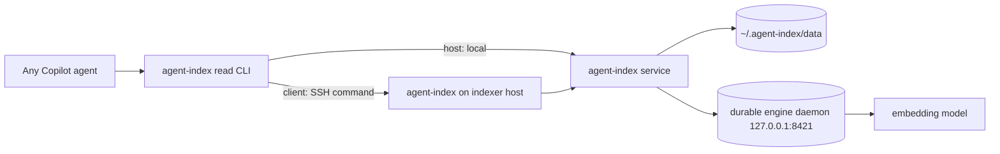

# agent-index architecture

`agent-index` is a runtime service plugin for local, repo-scoped retrieval. This
document describes the code that ships today. Vision documents remain intent;
implemented architecture lives here.

## Implemented state today

The current plugin includes:

- a Python package and `agent-index` CLI;
- a loopback FastAPI service with zdd routing and legacy rendezvous discovery;
- lightweight client runtime slots under `~/.agent-index/versions/<version>`;
- versioned host `[store,server]` slots selected by the plugin's own installer/cutover;
- durable service data under `~/.agent-index/data/`;
- a durable embedding-engine venv/daemon under `~/.agent-index/engine`;
- source connectors for local git, GitHub issues/PRs, and Azure DevOps work
items/PRs;
- chunkers for code, Markdown, YAML, and fallback text;
- LanceDB content/vector stores, path state, task queue, GC/repair, and
similarity-cluster artifacts;
- CLI (the agent-facing surface), HTTP, and an optional stdio MCP adapter
requiring the host dependency profile (unavailable in the base-only client);
- host/client role routing for read commands over SSH.

That means the old "Phase 1 service shell only" description is stale. Future
work still exists, but indexing and retrieval are present in the shipped code.

## Process model

The service itself is machine-local. Clients do not open a public listener or
run a local indexer daemon; project-aware read commands execute the same
`agent-index` CLI on the designated indexer over SSH. The dynamic service port
stays on the host and is resolved there.

## Install and runtime layout

| Area | Location | Owner |
|------|----------|-------|
| Runtime root | `~/.agent-index` | plugin installer |
| Client slots | Legacy `~/.agent-index/versions/<payload-version>`; namespaced profile-qualified slots | client installer |
| Client runtime marker | `~/.agent-index/current-version` | client installer selection only |
| Host runtime slots | `~/.agent-index/versions/<version>` or namespaced profile-qualified slots | plugin installer/cell reconciler selection, rollback, retention |
| zdd routing table | `~/.agent-index/active.json` | active service endpoint |
| Legacy rendezvous | `~/.agent-index/run/endpoint.json` | fallback diagnostics |
| Durable index/task data | `~/.agent-index/data/` | shared across service versions |
| Durable engine runtime | `~/.agent-index/engine/.venv` | heavy embedding stack |
| Machine config | `~/.agent-index/config.yaml` or `AGENT_INDEX_CONFIG` | role, device, client endpoints |
| Repo config | Checked-in defaults: `<repo>/.agent-index/config.yaml`; repo-local overlay: `<repo>/.copilot-extensions/agent-index/config.yaml` | corpus defaults, optional local indexer designation, and additive corpus overlays |

Host service replacement follows
`../../../docs/patterns/graceful-daemon-cutover.md`, while the durable engine
split follows `../../../docs/patterns/durable-vs-versioned-runtime.md`.
Index data and queued work remain durable and outside service runtime slots.
The independent embedding engine is neither provisioned nor restarted during a
routine service update or host replacement.

## Activation, lifecycle, and supervision

Activation is repository-scoped and fail-closed:

1. One resolver builds the effective current-repository config using the same
precedence model documented for the rest of the ``.agent-*`` ecosystem (see
`docs/configuration.md` and
`plugins/agent-worktrees/docs/config-reference.md`): **machine-local**
`<repo>/.copilot-extensions/agent-index/config.yaml` wins over the conditional
**knowledge overlay** `<knowledge>/.agent-index/config.yaml`, which wins over
the checked-in **in-repo** base `<repo>/.agent-index/config.yaml`. An optional
marketplace overlay under
`.copilot-extensions/agent-index/marketplaces/<marketplace>/config.yaml`
remains above the repo-local machine overlay. For ordinary keys this is a
straight "highest precedence wins per key" deep merge, including list
replacement. `corpus.sources` is the one deliberate exception: because the
entries are independent corpus declarations rather than one replaceable setting,
the resolver unions them by source `name`, with the higher-precedence layer
keeping the winning definition on duplicate names and lower-precedence layers
contributing only missing names. If no local repo config exists, the resolver
preserves the earlier fail-closed fallback: it may adopt the bound knowledge
repo's own effective config as the only activator. A present invalid local
config, an unsafe path, a conflicting singular/plural indexer declaration, a
missing required binding for external-only activation, or an unavailable
resolver leaves the plugin inactive.
2. Session-start hooks emit retrieval guidance while that resolver reports
active, then run a cheap `ensure` safety net. The hook never stamps or
provisions a runtime; it only health-checks the already-installed host runtime
and, when this machine is the configured host, starts the existing user-mode
service/engine if they are absent. Retrieval guidance belongs in the
exact-session guidance file when a session-file writer is present.
3. Every payload CLI entry runs the same resolver before installation-context
selection, runtime provisioning, or transport routing. `status` reports
structured `inactive` outside an opted-in repository; other commands are
refused.
4. In an active repository, admitted explicit commands may provision the light
service runtime locally. Setup writes the selected role without a second
role-specific engine provision. Noninteractive setup requires an explicit role
flag. The gate never executes a historical `payload-dir` installer as a
fallback, because that installer may retain obsolete host-install authority.
5. The installer-readiness probe is deliberately configuration-empty at session
start, including for opted-in repositories, so generic launch reconciliation
does not download packages or start services. Existing explicit installer and
runtime commands remain available.
6. The plugin's own installer/runtime lifecycle now builds, selects,
readiness-gates, replaces, rolls back, and retains the light host runtime. The
public `start` / `serve` entry points run the local service directly in the
selected interpreter, while installer `install` / `update` use `deploy` for
automatic zdd cutover when a live service is already serving. The durable
engine remains external to that runtime and is never rebuilt by an ordinary
service update.
7. Namespaced marker CAS, deploy-manifest publication, profile receipts, and
transaction recovery retain existing installation governance. Namespaced hosts
use the same local slot/cutover primitives as legacy mode. Compatibility
bootstrap/ensure hooks remain inert. Previously completed receipts remain
diagnostic/ownership evidence, never permission to bypass runtime validation.

Client runtime selection requires the canonical exact four-field
`.install-complete.json`, the strict role/extras profile receipt, a valid
`pyvenv.cfg`, and a successful `import agent_index` from beneath the selected
slot. POSIX permits only the standard `bin/python` venv symlink after validating
its owned parent slot and resolved executable; all other linked/reparse runtime
artifacts remain rejected. A partial or corrupt slot is never dispatched.

The default durable tier now registers the same stable launchers with the
lowest-privilege host mechanism that satisfies "restart on next logon without a
live Copilot session": Windows writes HKCU Run entries for the service and
durable engine; POSIX registers systemd --user units when available. Windows
Scheduled Tasks remain an explicit per-machine upgrade tier for hosts that want
pre-login start, missed-trigger recovery, or task-owned restart policy. Explicit
independent engine commands retain their existing lifecycle outside the light
service runtime.

## Service HTTP surface

The service binds `AGENT_INDEX_HOST` (default `127.0.0.1`) and
`AGENT_INDEX_PORT` (default `0`, an OS-assigned ephemeral port). It exposes:

| Endpoint | Meaning |
|----------|---------|
| `GET /health` | `{status: "passive"|"ok"|"draining"}` plus installation, PID, and instance token |
| `GET /status` | plugin/version, drain state, index counts/sources, indexing runner state |
| `GET /search` | semantic + lexical search; degraded JSON if unavailable |
| `GET /similar` | nearest neighbours for an indexed chunk |
| `GET /clusters` | near-duplicate cluster artifact |
| `POST /reindex` | enqueue background indexing unless draining/deps missing |
| `POST /drain`, `/undrain` | zdd cutover drain gates; namespaced calls require the exact instance token |
| `POST /promote` | instance- and transaction-owned pre-route passive promotion |
| `POST /shutdown` | ownership-attested service shutdown used by CLI/cutover |
| `POST /adopt-relay` | compatibility stub; returns no relay |

Endpoint discovery is local: zdd `active.json` first, then legacy rendezvous.
See `../../../docs/patterns/local-endpoint-discovery.md`.

## CLI surface

Public CLI verbs are implemented in `src/agent_index/__main__.py`:

- `stop`, `status`, `version`
- `start` / `serve`, `restart`, `deploy [--recover]` manage the local service
- `index [--source S] [--full]`
- `search <query> [--source S] [--language L] [--repo R] [--limit N] [--json]`
- `similar <chunk_id> [--limit N] [--source S]`
- `clusters [--source S] [--bucket B] [--model M] [--exact-dupes-only] [--limit N]`
- `mcp` for the direct FastMCP HTTP-client toolset
- `engine status|start|stop|run`
- `setup`, `role`, and `capability`

`index-worker` is an internal subprocess entry point used by the task runner.
`__cell-start` remains an installation-cell-owned launcher seam that validates
ownership before serving from a namespaced runtime.

## Indexing pipeline

`agent-index index` and `POST /reindex` use the same durable indexing core:

1. Resolve source specs from `AGENT_INDEX_SOURCES`, grafted `corpus.sources`, or
the default `git` source.
2. Crawl full or incremental changes through the source connector.
3. Chunk files/items.
4. Ensure the configured embedding engine is reachable.
5. Store canonical content and per-model vectors in LanceDB.
6. Reconcile deletions/stale chunks and persist commit markers.
7. Refresh similarity clusters best-effort when clustering is enabled.

Indexing is incremental by default; full reindex is explicit. The task queue is
SQLite/WAL under `~/.agent-index/data/tasks.db`. Service-triggered reindexes run
in detached versioned worker subprocesses, so a service cutover does not kill an
in-flight indexing job; the successor service re-adopts live workers or marks
dead ones interrupted/resumable.

Step 6 has two independent GC passes. `gc_stale_sources` purges abandoned
crawler NAMING SCHEMES (a stale generation, e.g. an old `forge:*` variant) and
runs only on a full reindex, paired with post-GC compaction. `gc_unconfigured_sources`
purges a source that a user simply removed from the layered `corpus.sources`
config sometime after it was indexed -- distinct from an abandoned scheme, and
cheap enough (one `source_counts()` scan) to run on EVERY reindex, incremental
included, whenever the run covers the full configured set (`--source` is not
given). This is what lets a config change -- e.g. dropping a source from the
harness's checked-in defaults, a knowledge-repo overlay, or a personal
override -- take effect on the very next routine reindex tick (the ~30-minute
`agent-dispatch` maintenance schedule already runs an incremental `agent-index
index`), with no full reindex and no service restart required. Both passes
share the `AGENT_INDEX_REINDEX_GC=0` opt-out and an `AGENT_INDEX_GC_KEEP_SOURCES`
escape hatch for reviving a remote-ingest source without a code change.

## Sources and corpus config

Registered source prefixes are `git`, `github`, `ado`, and `azure-devops`.

- `git` indexes local tracked files plus commit-history entries. It prefers the
remote default branch when available and falls back to local HEAD/working tree.
- `github:<owner>/<repo>` indexes GitHub issues and pull requests through the
GitHub connector.
- `ado:<org>/<project>` / `azure-devops:<org>/<project>` indexes only the
operator-configured work-item queries and pull-request queries. No query means
that side indexes nothing, by design.

Corpus config is intentionally outside the runtime. A repository activates
agent-index by carrying a valid checked-in `<repo>/.agent-index/config.yaml`
or, during the compatibility window, a legacy
`<repo>/.copilot-extensions/agent-index/config.yaml`. Mere plugin enablement
leaves the capability inactive and does not start or probe a service. When both
repo files exist, the checked-in `.agent-index/config.yaml` is the shareable
in-repo base and `.copilot-extensions/agent-index/config.yaml` is the
machine-local override layer. For repositories that require an external state
root, the bound knowledge repo's checked-in `.agent-index/config.yaml` is the
middle knowledge-overlay tier. This follows the established layered naming and
precedence used by agent-worktrees and the other `~/.agent-*` configs:
machine-local > knowledge overlay > in-repo base. The one intentional
agent-index-specific exception is `corpus.sources`: unlike ordinary list-valued
keys, it unions by source name so repo defaults, knowledge-repo declarations,
and private overlays can compose, with the higher-precedence layer winning any
duplicate name. `indexer` / `indexers` and every other key still follow the
ordinary replace-wholesale rule. For multi-repo harness use, the runtime sweeps
effective layered repo configs from locally adopted projects via the sibling
agent-worktrees registry; machine-local `~/.agent-index/config.yaml` can add
supplemental sources. The session-start scope-binding hook reads the same
layered model, and the installed runtime module (`agent_index.config`) now uses
that same external-state-root-aware resolver for `read_indexers()`,
`read_corpus_sources()`, and transport role planning, so the advertised config
and the live host/client routing decision stay aligned in the common
adopted-knowledge-repo case.

## Embedding engine and query behavior

The default model profile is `jinaai/jina-embeddings-v2-base-code` on engine
port `8421`. By default:

- `AGENT_INDEX_ENGINE_MODE=external`: the service does not manage the model
process during indexing; the durable engine daemon owns it.
- `AGENT_INDEX_SEARCH_IN_PROCESS=0`: query embedding also goes through the engine
client. If the engine is unreachable, search attempts a lexical/BM25 fallback.
- `agent-index engine start|stop|status|run` manages the durable engine daemon.
- `install.ps1|sh engine-update` is the explicit path that rebuilds/restarts the
heavy engine runtime; normal service updates preserve the warm engine.

Operators can opt into `subprocess`, `systemd`, or `auto` engine modes, or
in-process CPU query embedding, but those are configuration choices rather than
the shipped default.

## Retrieval + MCP surfaces

Retrieval is agent-facing through the **`agent-index` read CLI**, and there is a
separate lower-level MCP surface:

1. **`agent-index` read CLI (the agent path)** — every agent calls
   `agent-index search` / `similar` / `clusters` / `status` **directly**;
   there is no sub-agent and no MCP-tool wrapper. agent-index is a uniform
   retrieval capability every agent may use, so how-to-search guidance is
   documented by the plugin skills and command catalog rather than delivered
   through aggregate sessionStart `additionalContext`. The CLI transport
   handles host/client SSH routing, so the same commands work on a host (local)
   or a client (over SSH).
2. **Direct `agent-index mcp`** — `src/agent_index/mcp_app.py` exposes HTTP-client
   FastMCP tools (`agent_index_search`/`find_similar`/`clusters`/`status`) plus
   `agent_index_reindex`. It resolves `AGENT_INDEX_ENDPOINT` first, then local
   endpoint discovery. This is a lower-level surface for embedding/automation, not
   the agent retrieval path.

## Robustness and fail-loud behavior

Implemented safeguards include:

- versioned service slot activation with completion markers and garbage
collection that protects live PIDs;
- installer self-staging and watchdog bounds to avoid wedging the singleton
plugin payload;
- zdd active/passive service cutover with drain/undrain and breadcrumb recovery;
- atomic read admission: drain closes `search`, `similar`, and `clusters`
  admission before waiting for already-admitted reads;
- passive generations remain task-runner and shared-evidence inert until
  explicit promotion;
- durable marker+manifest transaction recovery for forward updates and
  historical rollback, with governance rechecks at both mutation boundaries;
- installation-scoped service-instance receipts and exact-token reconciliation
  that converge successful and recovered cutovers to one owned PID;
- durable queue + detached workers for reindex work across cutovers;
- engine reachability checks before vectorization so a source fails loudly rather
than committing unsearchable content;
- degraded JSON responses for unavailable search/cluster/status paths instead of
tracebacks;
- capability-aware embed batch sizing and configurable embed read timeout;
- FTS (BM25) index maintenance self-heals from a non-retryable incremental
  rebuild failure (e.g. a lancedb/lance-index panic against stale on-disk
  index state) by escalating once to a full `create_fts_index(replace=True)`
  rebuild in the same cycle, rather than backing off a failure that can never
  resolve on its own; a genuinely retryable commit conflict still uses the
  existing capped-backoff retry instead.

## Planned or not present

- Query-time trust-domain enforcement is not implemented; callers must scope
queries with `source`/`repo` when crossing trust domains.
- Cross-process source locks during a service cutover are not implemented; store
locking is relied on for the narrow overlap window.
- The plugin does not expose a public network listener, gateway, or relay.
- The read-only agent-facing CLI surface does not expose reindexing.
- There is no plugin-local clean-room scenario under `plugins/agent-index`; fresh
install/runtime changes should use the repo-level clean-room framework when
practical.